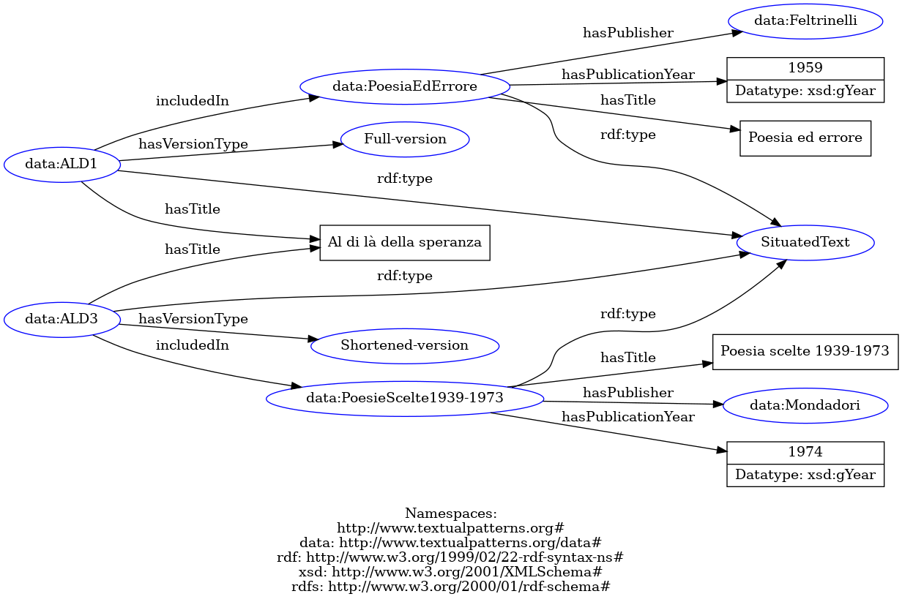

## Example of SPARQL query
(tested on a local instatiation of GraphDB by Ontotext - with reasoning set to OWL2 QL)

```sparql
PREFIX : <http://www.textualpatterns.org#>
PREFIX rdfs: <http://www.w3.org/2000/01/rdf-schema#>

SELECT ?poem ?versionType?collectionTitle ?publisherName ?pbYear WHERE {
    ?poem a :SituatedText; 
          :hasTitle "Al di là della speranza";
          :hasVersionType ?versionType;
          :includedIn ?collection.
    ?collection a :SituatedText;
                :hasTitle ?collectionTitle;
                :hasPublisher/rdfs:label ?publisherName;
                :hasPublicationYear  ?pbYear}
```
### Result of query:


The query can be easily made more specific to retrieve the situated texts by a specific author (object property :hasAuthor) or publisher, just to make some examples.

### Example of RDF graph 
(it shows two texts, one for the full-version, one for the shortened-version)


