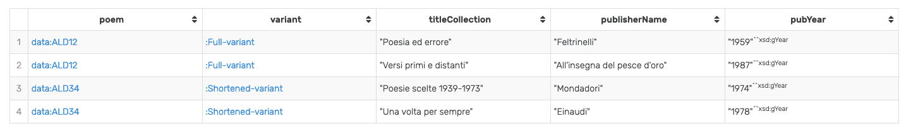
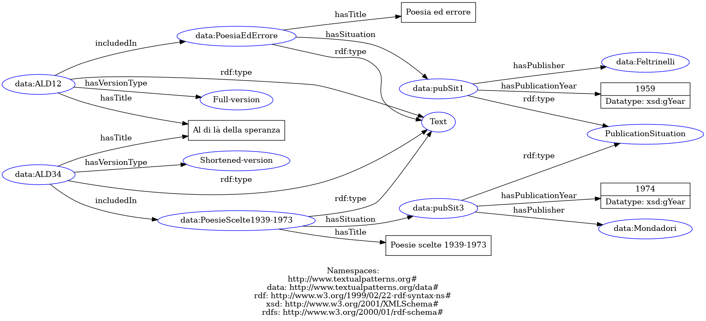

## Example of SPARQL query
(tested on a local instatiation of GraphDB by Ontotext - with reasoning set to OWL2 QL)

```sparql
PREFIX : <http://www.textualpatterns.org#>
PREFIX rdfs: <http://www.w3.org/2000/01/rdf-schema#>
SELECT ?poem ?version ?titleCollection ?publisherName ?pubYear WHERE { 
    ?poem a :Text;
        :hasVersionType ?version;
       :hasTitle "Al di là della speranza";
       :includedIn ?collection.
    ?collection a :Text;
        :hasTitle ?titleCollection;
        :hasSituation ?s.
    ?s a :PublicationSituation;
       :hasPublisher/rdfs:label ?publisherName;
        :hasPublicationYear ?pubYear} 
```
### Result of query:



The query can be easily made more specific to retrieve the situated texts by a specific author (object property :hasAuthor) or publisher, just to make some examples. Differently from the situated-text-pattern, note that information about the publisher is here represented at the level of the publication situation.

### Example of RDF graph 
(it shows two texts, one for the full-version, one for the shortened-version, with the corresponding publishing situations) 


