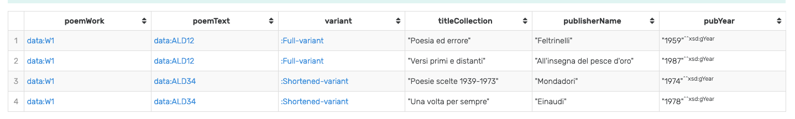

## Example of SPARQL query
tested on a local instatiation of GraphDB by Ontotext (with reasoning set to OWL2 QL)

```sparql
PREFIX : <http://www.textualpatterns.org#>
PREFIX rdfs: <http://www.w3.org/2000/01/rdf-schema#>

SELECT ?poemWork ?poemText ?variant ?titleCollection ?publisherName ?pubYear WHERE { 
	?poemWork a :DocumentaryWork; 
           :hasTitle "Al di là della speranza";
           :groups ?poemText.
    ?poemText a :Text;
          :hasVariantType ?variant;
          :includedIn ?collectionText.
    ?collectionText a :Text;
        :hasTitle ?titleCollection;
        :hasSituation ?s.
    ?s a :PublicationSituation;
       :hasPublisher/rdfs:label ?publisherName;
       :hasPublicationYear ?pubYear
      }

```
Result of query:

